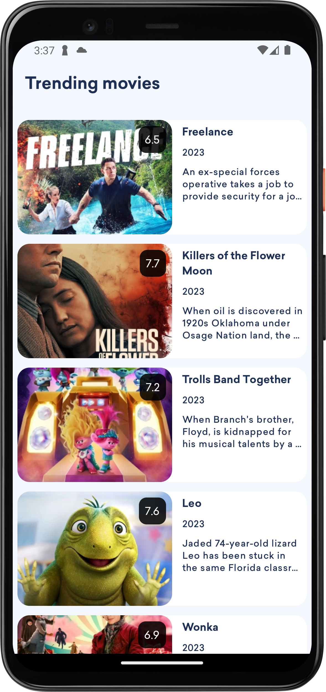

QRScan - Android app

<b>Overview</b>

QRScan is an amazing and beautiful native Android app that lets you scan and generate with ease QR codes and barcodes. You can store them in your local database to get them back later or you can save the generated and the scanned QR codes to your local files so you can share them.

<b>Features</b>
<ul>
	<li>Scan and generate QR codes and Barcodes.</li>
	<li>Save them locally to your files or database.</li>  
	<li>Admob ads integrated.</li>
	<li>Android 12 Compatible app.</li>
 	<li>Easily customizable.</li>
  	<li>Clean Kotlin code.</li>
</ul>

